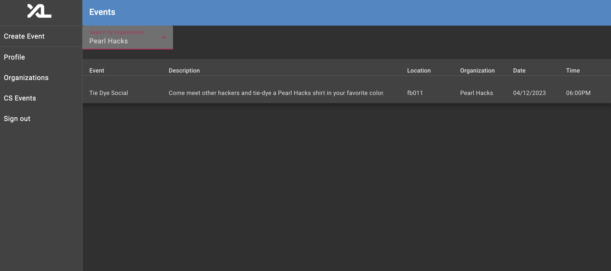

# Student Organizations Feature

Authors: [Cecilia Lee](https://github.com/ceciliallee), [Kelly Fan](https://github.com/krenfan), [Sarika Simha](https://github.com/sarsimha), [Sonika Puvvada](https://github.com/sonikacp)

## Table of Contents

* [Purpose of Feature](#purpose-of-feature)
* [Data Models](#data-models)
* [Viewing Student Organizations](#viewing-student-organizations)
* [Viewing Events](#viewing-events)
* [Creating Events](#creating-events)
* [Updating Events](#updating-events)
* [Deleting Events](#deleting-events)
* [Frontend Dependencies](#frontend-dependencies)

## Purpose of Feature

The student organizations achieve the following user stories:

- As Sol Student, view a list of student organizations and their details
- As Sol Student, view a list of events hosted by student organizations
- As Sol Student, view a list of events for a select student organization
- As Eli Exec, fill out a form to create an event hosted by their student organization
- As Eli Exec, fill out a form to update an event
- As Eli Exec, click a button to delete an event

## Data Models

We have created the following data models:
- Organization: a model for Student Organization that has the id, name, and description. 
- Event: a model for an Event created by a Student Organization that has the event name, description, organization, location, date, and time.

## Viewing Student Organizations

### Backend Logic
For development purposes, we created three dummy organization objects, `pearl_hacks`, `app_team`, and `black_technology`, that are initalized once running `backend/script/reset_database`.

#### API
`backend/api/organization.py` creates the API routes and method `get_orgs()` to retrieve all existing organizations.

#### Services
`backend/services/organization.py` creates the Organization Service that has method `all()` that calls SQL query to parse all Organization Entities in the list that returns the equivalent Organization Models. 

### Frontend
The folder `frontend/src/app/organizations` contains the implementation for viewing organizations.
`organizations.service.ts` creates the Organizations Service that has a method `getAllOrganizations()` that makes an HTTP GET request to return the list of organizations.

## Viewing Events

### Backend Logic
For development purposes, we created dummy event objects that are initalized once running `backend/script/reset_database`.

#### API
`backend/api/event.py` creates the API routes and method `get_events()` to retrieve all existing events.

#### Services
`backend/services/event.py` creates the Event Service that has method `all()` that calls SQL query to parse all Event Entities in the list that returns the equivalent Event Models. 

### Frontend
The folder `frontend/src/app/event` contains the implementation for viewing events.
`event.service.ts` creates the Events Service that has a method `getAllEvents()` that makes an HTTP GET request to return the list of events.

### Filtering by event
Users are able to view events based on organization of interest. In `backend/api/event.py`, there is an API method called `get_events_org` where we can pass in the organization name as a string, and that function searches for the events where their organization name field matches the input, and returns that new list of events. The frontend event component in `event.service.ts` utilizes this method to refresh the current observable list of events that will be displayed.

The drop down on the top left corner of the page allows for users to choose an organization. Below shows of the filter being selected to Pearl Hacks and only showing events that are hosted by Pearl Hacks.

### Order events by date and time
Users are able to view events ordered from nearest to furtherest in time in the events page. In `event.component.ts`, there is a function `orderEvents()` that returns the Observable of Event list sorted by date and time. This is called in the constructor so the ordered list shows immediately on the page. The filtering functions `searchOrganizations(org: string)` and `getAllEvents` were modified so that the list of Events was also sorted by date and time.

## Creating Events

### Backend logic

In order to ensure that only Organization Executives are able to create a new event into the database, we created a new 'Eli Executive' user in `backend/script/dev_data/users.py` with a role defined in `backend/script/dev_data/roles.py` as an 'Organization Executive', binded as a pair in `backend/script/dev_data/user_roles.py`. We add a permission to create an event in `backend/script/dev_data/permissions.py` for the organization executive role. 

#### API
`backend/api/event.py` creates the API routes and method `create_event()` to create a new event and add to the existing event database while checking if the user is an Eli Exec. 

#### Services
`backend/services/event.py` creates the Event Service and has method `create_event()` that calls SQL query to create a new Event Entity then adds it to the session and returns the equivalent Event Model. This only happens if the user is an Eli Exec. 

### Frontend
The folder `frontend/src/app/event-reg` contains the implementation for creating events.
`event-reg.service.ts` creates the EventReg Service that has a method `createEvent(name: string, orgName: string, location: string, description: string, date: string, time: string)` that makes an HTTP POST request to create a new event. 

## Updating Events

### Backend logic

In order to ensure that only Organization Executives are able to create a new event into the database, we created a new 'Eli Executive' user in `backend/script/dev_data/users.py` with a role defined in `backend/script/dev_data/roles.py` as an 'Organization Executive', binded as a pair in `backend/script/dev_data/user_roles.py`. We add a permission to update an event or get an event by ID in `backend/script/dev_data/permissions.py` for the organization executive role. 

#### API
`backend/api/event.py` creates the API routes and method `update_event()` to update an event by the ID and put it in the database. The method `get_event()` gets the event by the id and returns that specific event. Both methods check to see if the user is an Eli Exec. 

#### Services
`backend/services/event.py` creates the Event Service and has methods `get_event()` and `update_event()`. The method `get_event()` calls a SQL query to find the Event with a specific ID from the Events database and returns the equivalent Event Model. The method `update_event()` updates the event and returns the updated Event Model. Both methods only happen if the user is an Eli Exec. 

### Frontend
The folder `frontend/src/app/update-event` contains the implementation for updating events.
`update-event.service.ts` creates the UpdateEvent Service that has a method `updateEvent(eventId: number, name: string, orgName: string, location: string, description: string, date: string, time: string)` that makes an HTTP PUT request to update an existing event with new fields for orgName, location, description, date and time. The update events page can be accessed from the navigation bar for users with exec permissions.

## Deleting Events

### Backend Logic

In order to ensure that only Organization Executives are able to delete an event from the database, we restricted all event functions to 'Eli Executive' user in `backend/script/dev_data/permissions.py` for the organization executive role.

#### API
`backend/api/event.py` creates method `delete_event()` to delete an event by event ID from the event database while checking if the user is an Eli Exec. 

#### Services
`backend/services/event.py` has method `delete_event()` that gets the Event entity by event ID from the session, deletes that Event entity from the session, and commits the change to the session. It returns true once the function is complete. This only happens if the user is an Eli Exec. 

### Frontend
The folder `frontend/src/app/event` contains the implementation for deleting events.
`event.service.ts` has a method `deleteEvent(eventId: number)` that makes an HTTP DELETE request to delete an event by event ID. 
`event.component.ts` has a method `deleteEvent(eventId: number, eventName: string)` that once the delete button is clicked, it calls the confirm function of the ConfirmDelete Service. If outcome of confirm is true, then it deletes the event by calling deleteEvent function of the Event Service, otherwise nothing is changed.

The folder `frontend/src/app/event/confirm-delete` contains the implementation for confirmation pop-up of event deletion.
`confirm-delete.service.ts` creates the ConfirmDelete Service that has a method `confirm(title: string, message: string)` that opens a dialog pop-up with specified title and message. It returns true for confirm or false for cancel once a button is clicked and the dialog is closed.

## Frontend dependencies:
1. `npm install angular-mat-datepicker`
2. `npm install --save ngx-material-timepicker`
